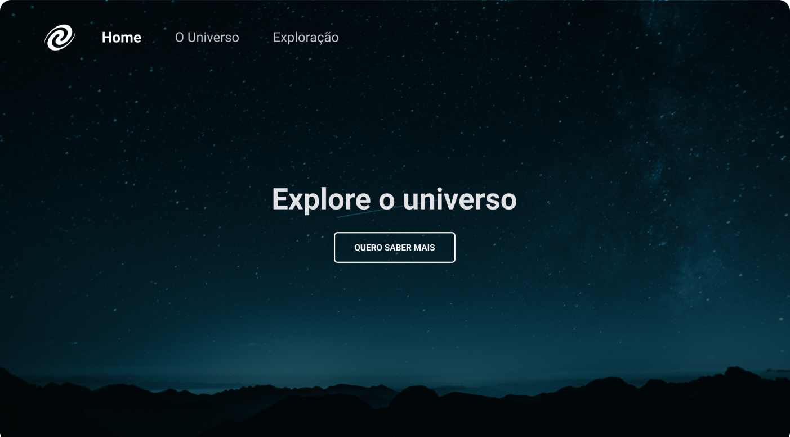

<h1 align="center"> SPA Universe </h1>

Programa promovido no nível 6 da trilha Explorer da Rocketseat, cujo objetivo foi a criação de uma página de exploração do universo utilizando o conceito de Single Page Application (SPA).

O que foi abordado nesse desafio:

- Conceitos de SPA;
- Mapeamento de rotas;
- Assincronismo e promises;
- Orientação a objetos;
- Classes e muito mais.
    

---
Feito por Bernardo Sá :wave: [Participe da comunidade da Rocketseat!](https://discord.gg/rocketseat)